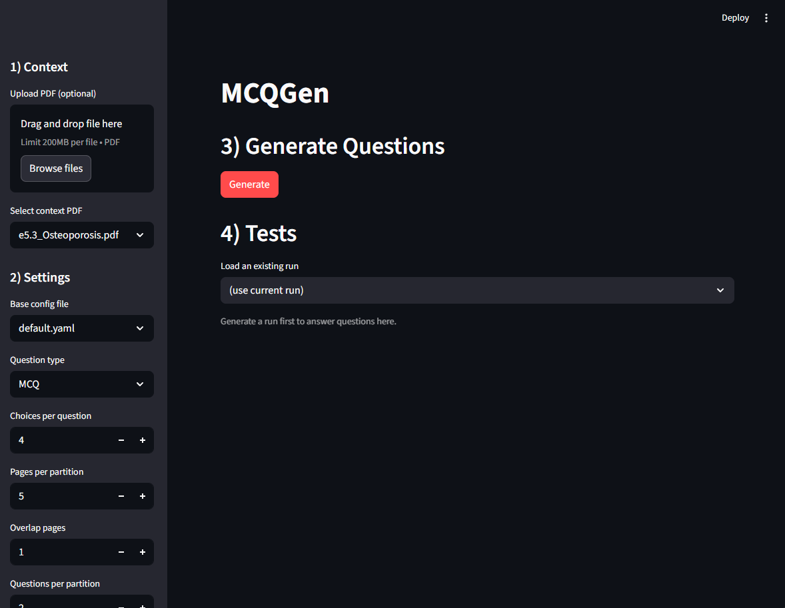
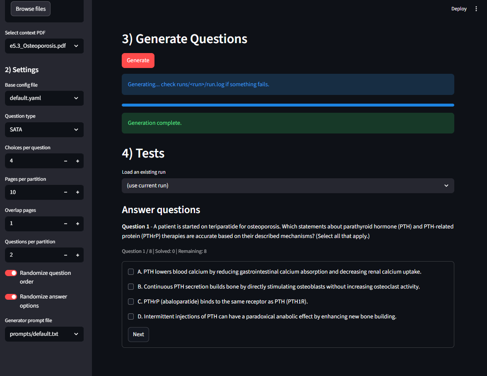
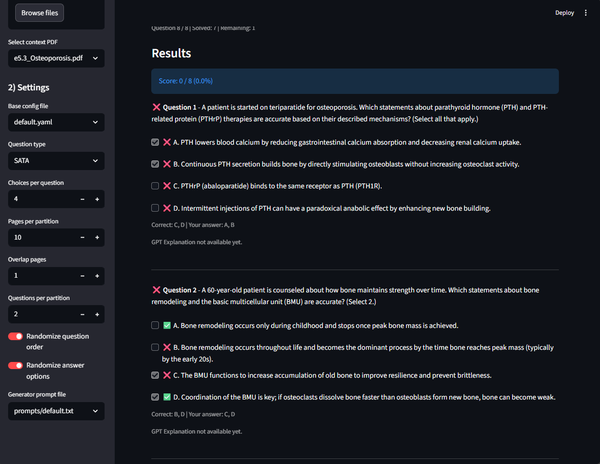
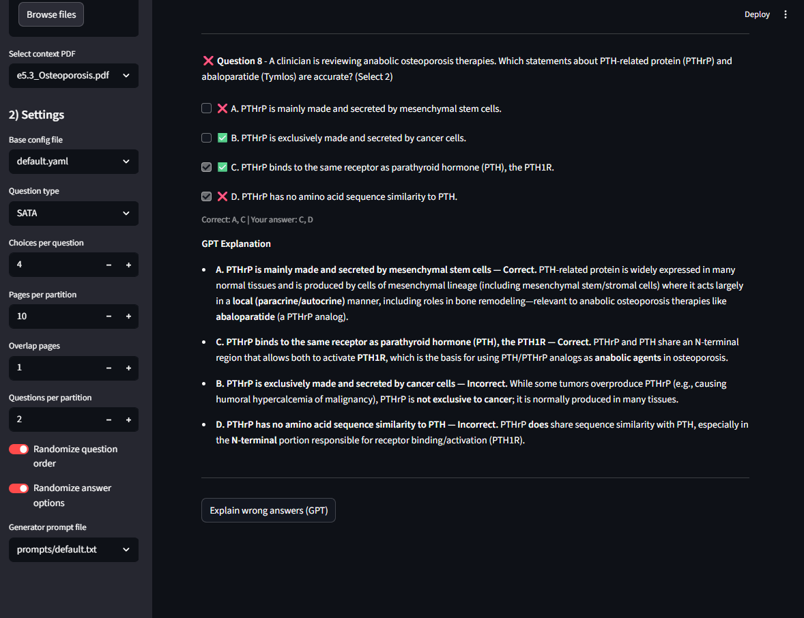

# MCQ-Gen

Generate MCQ and SATA questions from PDF context using an LLM, then take a simple test and get explanations for incorrect answers.

## Features
- PDF extraction and page chunking
- MCQ and SATA generation via OpenAI Responses API
- Mock generation mode for offline testing
- Streamlit UI for easier visualization
- Explain-only workflow using wrong IDs

## Requirements
- Python 3.9+
- OpenAI API key

## Setup (once)

1) Create an API key file:
```
echo sk-your-key-here> .openai_key
```

2) Install dependencies (editable):
```
pip install -e .
```

## Quick start (Streamlit UI)

Option A: One-click launcher (Windows)
- Double-click `run_app.bat`

Option B: Manual
```
streamlit run streamlit_app.py
```

## UI preview






## Quick start (CLI)

Generate questions:
```
mcqgen generate --config configs/default.yaml --context e5.3_Osteoporosis.pdf --verbose
```

Mock generation (no API):
```
mcqgen generate --config configs/default.yaml --mock-llm --context e5.3_Osteoporosis.pdf --verbose
```

Explain wrong answers:
```
mcqgen explain --run runs/<run_id> --wrong wrong_ids.json --verbose
```

Example `wrong_ids.json`:
```
{
  "wrong_question_ids": ["q_0001", "q_0007"]
}
```

## Project layout

```
configs/                 YAML configs
contexts/                PDF inputs
prompts/                 User-editable prompts (top section only)
prompts/fixed_prompts/   Fixed system rules per mode (MCQ/SATA)
runs/                    Outputs per run
streamlit_app.py         Streamlit UI
mcqgen/                  Python package
```

## Prompts

Prompts are split into:
- User prompt (editable): `prompts/default.txt`
- Fixed prompt per mode:
  - `prompts/fixed_prompts/mcq_fixed_v1.txt`
  - `prompts/fixed_prompts/sata_fixed_v1.txt`

The final prompt sent to the model is:
```
user prompt + fixed prompt
```

## Configs

Key files:
- `configs/default.yaml` (MCQ)

Each config specifies:
- question type
- choices per question
- partitioning
- randomization
- prompt files
- LLM model settings

## Notes

- `.openai_key` is gitignored.
- Output runs are stored under `runs/<timestamp>__<context>/`.
- SATA correct-answer counts are randomized in code and passed to the model as a per-question list.
